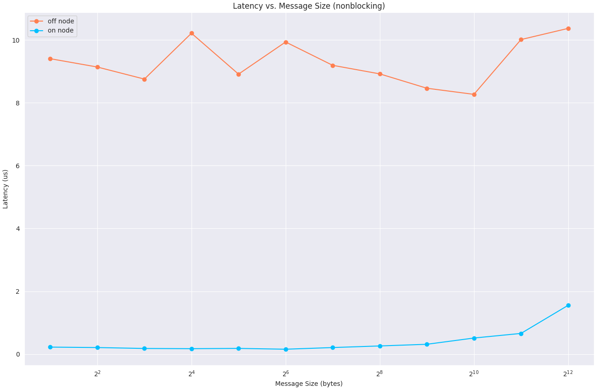

# 
 CMSE 822 &nbsp;&nbsp;&nbsp; SS24
## 
  Project 3 MPI Ping-Pong and Ring Shift

  &#9786; Team 1  

  Benjamin DalFavero, Reza Khan Mohammadi, Tairan Song, Xiaotian Hua, Ziyu Cheng
  

## Part 1 :  Blocking Ping-Pong

On two nodes of amd20, one processor is selected from each node to exchange data, and the results after 100 iterations are as follows:
| Message Size (bytes) | Time (us) | Bandwidth (Megabytes/s) | Latency (us) |
|----------------------|-----------|-------------------------|--------------|
| 2                    | 32.552    | 0.123                   | 16.276       |
| 4                    | 31.246    | 0.256                   | 15.623       |
| 8                    | 30.550    | 0.524                   | 15.275       |
| 16                   | 31.341    | 1.021                   | 15.670       |
| 32                   | 31.778    | 2.014                   | 15.889       |
| 64                   | 32.391    | 3.952                   | 16.195       |
| 128                  | 32.612    | 7.850                   | 16.306       |
| 256                  | 33.672    | 15.206                  | 16.836       |
| 512                  | 33.597    | 30.479                  | 16.799       |
| 1024                 | 35.299    | 58.018                  | 17.650       |
| 2048                 | 37.524    | 109.158                 | 18.762       |
| 4096                 | 48.565    | 168.680                 | 24.283       |

The graphs of message size versus bandwidth and latency are shown as follows:

We can observe that the bandwidth increases with the message size. However, at 170 Megabytes/s, it is far from reaching the maximum bandwidth, so the plot still shows a rapid upward trend.

When the number of processing elements is fixed (2 in this case), the main consideration is the impact of the data size on latency. In the above figure, the latency increases rapidly when the message size exceeds 1024 bytes. This may be due to reaching the maximum transmission unit limit for packets between the two nodes, resulting in latency caused by data segmentation.

## Part 2 :  Non-block Ping-Pong

Due to the significant fluctuations in the data with 100 iterations, increasing the iterations to 500 results in a smoother curve and clearer characteristics. The specific results are as follows:

 | Message Size (bytes) | Time (us) | Bandwidth (Megabytes/s) | Latency (us) |
|----------------------|-----------|-------------------------|--------------|
| 2                    | 12.346    | 0.324                   | 6.173        |
| 4                    | 11.749    | 0.681                   | 5.874        |
| 8                    | 12.355    | 1.295                   | 6.178        |
| 16                   | 12.395    | 2.582                   | 6.198        |
| 32                   | 11.161    | 5.734                   | 5.580        |
| 64                   | 12.658    | 10.112                  | 6.329        |
| 128                  | 12.529    | 20.433                  | 6.264        |
| 256                  | 11.389    | 44.955                  | 5.695        |
| 512                  | 12.692    | 80.682                  | 6.346        |
| 1024                 | 12.726    | 160.926                 | 6.363        |
| 2048                 | 14.883    | 275.205                 | 7.442        |
| 4096                 | 18.485    | 443.172                 | 9.242        |

The graphs of message size versus bandwidth and latency are shown as follows:

Compared to the results in Part 1, the bandwidth under the non-blocking ping-pong scenario exhibits a similar upward trend but with a greater magnitude of increase. Due to non-blocking communication not consuming time on blocking issues, the same message size should result in a larger bandwidth.

The latency also exhibits similar changes. The overall latency is significantly reduced, approximately only 1/3 of the results from Part 1. However, the latency still increases rapidly once the message size exceeds 1024 bytes, likely due to the same reason as analyzed earlier, which is the MTU limit.

## Part 3: MPI Ring Shift

| Message Size (bytes) | Bandwidth (Megabytes/s) | Latency (us) |
|----------------------|-------------------------|--------------|
| 2                    | 13.351135               | 0.149800     |
| 4                    | 27.247956               | 0.146800     |
| 8                    | 54.403264               | 0.147050     |
| 16                   | 130.505710              | 0.122600     |
| 32                   | 365.296804              | 0.087600     |
| 64                   | 673.329826              | 0.095050     |
| 128                  | 1294.236603             | 0.098900     |
| 256                  | 1827.918600             | 0.140050     |
| 512                  | 1094.017094             | 0.468000     |
| 1024                 | 5188.750950             | 0.197350     |
| 2048                 | 8478.575864             | 0.241550     |
| 4096                 | 3705.110810             | 1.105500     |

  
## Part 4: Non-blocking MPI Ring Shift

| Message Size (bytes) | Bandwidth (Megabytes/s) | Latency (us) |
|----------------------|-------------------------|--------------|
| 2                    | 12.965964               | 0.154250     |
| 4                    | 27.835769               | 0.143700     |
| 8                    | 50.648940               | 0.157950     |
| 16                   | 101.813554              | 0.157150     |
| 32                   | 140.907089              | 0.227100     |
| 64                   | 413.169787              | 0.154900     |
| 128                  | 517.904107              | 0.247150     |
| 256                  | 1415.929204             | 0.180800     |
| 512                  | 1686.985173             | 0.303500     |
| 1024                 | 1719.996641             | 0.595350     |
| 2048                 | 2825.412154             | 0.724850     |
| 4096                 | 2692.611097             | 1.521200     |

